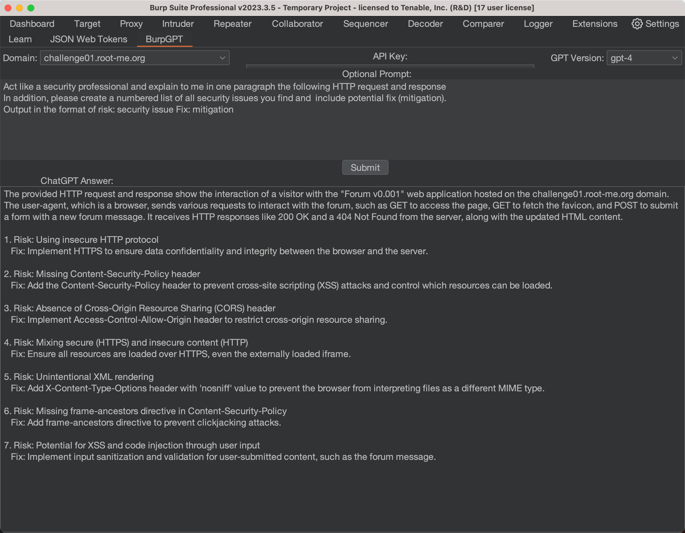

# BurpGPT

    

## Introduction

a powerful Burp Suite extension that leverages the power of OpenAI to analyze HTTP traffic and identify potential security concerns. BurpGPT automates the process of identifying common web application vulnerabilities, reducing the manual effort required for security testing and allowing developers to focus on more critical issues.

## Features

- 🤖 Burp Suite is a powerful tool for manual testing of web app security vulnerabilities.
- 🚀 BurpGPT is an extension for Burp Suite that uses GPT for analysis of HTTP requests and responses.
- 🛡️ BurpGPT can identify risks and potential fixes for injection points and misconfigurations.
- 📈 GPT3.5 and GPT4 can identify Top 10 OWASP vulnerabilities and misconfigured HTTP headers without additional fine-tuning.
- 👨‍💻 BurpGPT can reduce manual testing and automate security testing for web app developers.

## Summary

Web applications provide a unique attack surface due to the complexities in identifying vulnerabilities within them. Tools like our Tenable Vulnerability Management Web App Scanning product provide comprehensive and automated vulnerability scanning for modern web applications. However, as researchers we continue to explore new avenues for exploitation. This research helps us to increase the efficacy of our products. One of the most powerful tools we utilize in our web application research is Burp Suite. Burp provides a fantastic suite of features to aid in manual testing for web app security vulnerabilities. In our efforts to identify ways in which AI could benefit web application security, we looked at how we could integrate ChatGPT and Burp Suite to identify common web application vulnerabilities and recommend solutions to address them.

We built BurpGPT as an extension for Burp Suite to allow researchers to utilize GPT for analysis of HTTP requests and responses. The tool works by leveraging Burp's proxy feature to intercept HTTP traffic and prompts the OpenAI API to analyze the traffic to identify risks and potential fixes to any issues identified. This can be used to discover injection points, misconfigurations and more. As we developed this extension, we tested some real-world scenarios and we found that GPT3.5 and GPT4 successfully identified Cross-Site Scripting (XSS) vulnerabilities and misconfigured HTTP headers without requiring any additional fine-tuning. These capabilities can have dramatic impacts on reducing manual testing and automating security testing for web application developers. In addition, it gives our researchers another tool in their arsenal to help identify novel new exploitation techniques that can be implemented into our WAS solution.

## Quickstart

### Installation

1. Download Burp Suite extension if you haven't already done so.
2. Download Jython standalone JAR: http://www.jython.org/download.html
3. Open burp -> Extender -> Options -> Python Environment -> Select File -> Choose the Jython standalone JAR
4. Open Burp -> Extender -> Extensions -> Add -> Choose burp_gpt.py file.

### Usage

1. Select a domain from your HTTP history.
2. Provide an optional prompt, such as a specific vulnerability you are looking for.
3. Enter your OpenAI API key.
4. Choose a ChatGPT version - either GPT-4 or GPT-3.5 Turbo.
5. Click "analyze" and let BurpGPT do the rest.

BurpGPT will automatically analyze the HTTP history for the specified domain, collect data, and send it, along with the prompt, to the OpenAI API. Once the response is received, BurpGPT will display the answer in the user-friendly BurpGPT UI.

With BurpGPT, identifying potential security concerns in your web applications has never been easier. Follow these simple steps and start using BurpGPT today to take the first step towards a more secure web.

.

## Disclaimer

This extension is provided for educational and research purposes only. The authors assume no liability and are not responsible for any misuse or damage caused by this extension.

## License

This project is licensed under the GPL License. See the LICENSE file for more details.